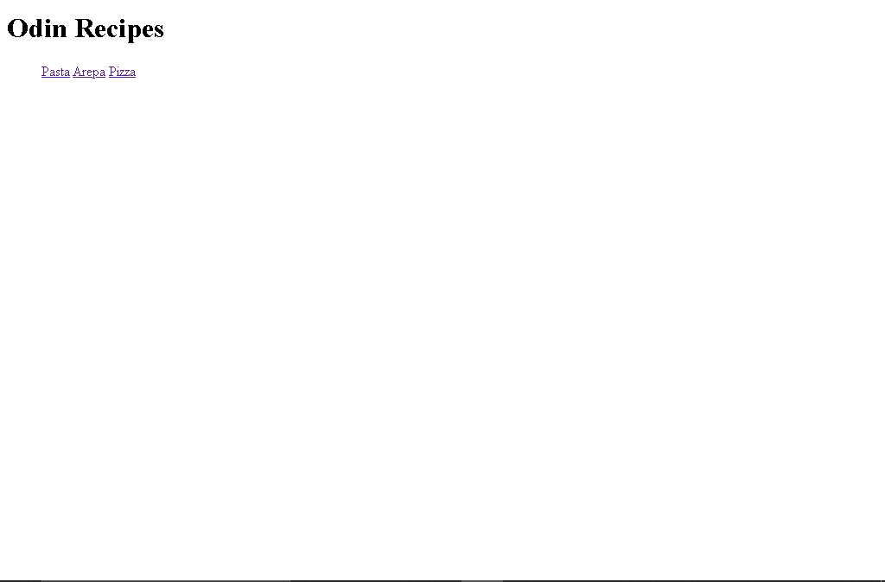

# Odin Recipes

> This project talks about reciepes. Here, we describe three different recipes, the recipe of pasta, the recipe of pizza, and the recipe of the arepa.

## Built With

- Major languages
HTML
- Frameworks
HTML Boilerplate
- Technologies used
VSCode
Git Bash

## Live Demo

[Live Demo Link](https://github.com/danielgomez06/odin-recipes/actions)

## Getting Started

**This project is about three different recipes, describing then, naming the ingredients and telling how it´s get done step by step.**
<<<<<<< HEAD

=======
>>>>>>> 2126d164fd741fb9d46bab357052e781e2f14473

To get a local copy up and running follow these simple example steps.

### Prerequisites

### Setup

### Install

### Usage

### Run tests

### Deployment

## Authors

👤 **Daniel Eduardo Gómez Villalobos**

- GitHub: [@danielgomez06](https://github.com/danielgomez06)

## 🤝 Contributing

Contributions, issues, and feature requests are welcome!

<<<<<<< HEAD
Feel free to check the [issues page](https://github.com/danielgomez06/odin-recipes/issues).

=======
>>>>>>> 2126d164fd741fb9d46bab357052e781e2f14473
## Show your support
 
Give a ⭐️ if you like this project!

## Acknowledgments

- Thanks to Google and GitHub for letting us work in such a good platform.
- Thanks to aristides1000 who was the inspiration of doing this project.

## 📝 License

This project is [CC0 1.0 Universal](LICENSE) licensed.
